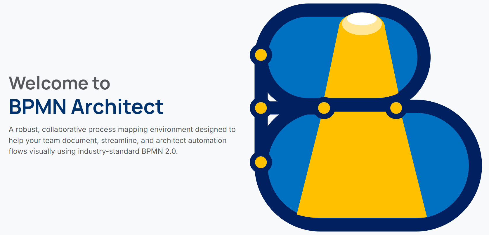

  

  <h1>BPMN Architect v0.1.1</h1>
  
<strong>Collaborative Process Mapping & Self-Hosted Live BPMN Editor</strong>

  

    
    
    
    
    
  

---

## Overview

**BPMN Architect** is a robust, lightweight, self-hosted Live BPMN Editor tailored for secure, real-time enterprise process modeling. Designed with a priority on data integrity, it uses local storage for `.bpmn` XML payloads and a centralized SQLite database for high-performance lock management and metadata handling.

This platform bridges the gap between sophisticated BPMN modeling via `bpmn.io` and zero-collision collaboration, ensuring a consistent and friction-free process mapping experience for your organization.

[View Repository](https://github.com/unfoundry/bpmn-architect)